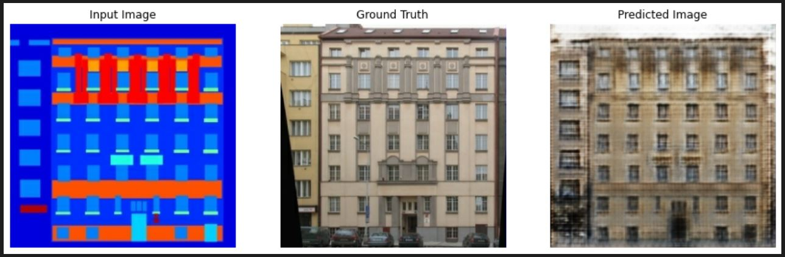

[![Contributors][contributors-shield]][contributors-url]
[![Forks][forks-shield]][forks-url]
[![Stargazers][stars-shield]][stars-url]
[![Issues][issues-shield]][issues-url]

  

  <h3 align="center" style="font-size:30px;margin:10px">Pix2pix Facade Generation</h3>
  

    <!--  
    <a href="https://huggingface.co/spaces/darkCat/Pix2pix-Facade-Generation"><strong>Play the model »</strong></a>
      -->
    <!--   -->
    <a href="https://github.com/dr413677671/Pix2pix-Facade-Generation/README.md">Explore the docs</a>
    ·
    <a href="https://github.com/dr413677671/Pix2pix-Facade-Generation/issues">Report Bug</a>
    ·
    <a href="https://github.com/dr413677671/Pix2pix-Facade-Generation/issues">Request Feature</a>
  

<!-- ABOUT THE PROJECT -->

## About this project

Pix2pix on facade generation, based on [facade dataset](http://efrosgans.eecs.berkeley.edu/pix2pix/datasets/).

## Features:

- [x] Model
    - [x] Pix2pix
- [ ] Data Augmentation
- [ ] Hyperparameter Search
- [ ] Ensemble Learning
- [x] Others
    - [x] Standardlization

### Built With

<!-- * [![Python][python-img]][python-url] -->
* [![Tensorflow][Tensorflow]][Tensorflow-url]
* [![Keras][Keras]][Keras-url]

## Contact

 &nbsp;&nbsp;  &nbsp;&nbsp;  

## Acknowledgments

* [Pix2pix](https://github.com/phillipi/pix2pix)
* [Pix2pixHD](https://github.com/NVIDIA/pix2pixHD)
* [Facade Dataset](http://efrosgans.eecs.berkeley.edu/pix2pix/datasets/)
* [pix2pix: Image-to-image translation with a conditional GAN](https://www.tensorflow.org/tutorials/generative/pix2pix)
* Logo genetrared by <a href="https://github.com/CompVis/stable-diffusion">Stable-Diffusion</a>

(<a href="#readme-top">back to top</a>)

[contributors-shield]: https://img.shields.io/github/contributors/dr413677671/Pix2pix-Facade-Generation.svg?style=for-the-badge
[contributors-url]: https://github.com/dr413677671/Pix2pix-Facade-Generation/graphs/contributors
[forks-shield]: https://img.shields.io/github/forks/dr413677671/Pix2pix-Facade-Generation.svg?style=for-the-badge
[forks-url]: https://github.com/dr413677671/Pix2pix-Facade-Generation/network/members
[stars-shield]: https://img.shields.io/github/stars/dr413677671/Pix2pix-Facade-Generation.svg?style=for-the-badge
[stars-url]: https://github.com/dr413677671/Pix2pix-Facade-Generation/stargazers
[issues-shield]: https://img.shields.io/github/issues/dr413677671/Pix2pix-Facade-Generation.svg?style=for-the-badge
[issues-url]: https://github.com/dr413677671/Pix2pix-Facade-Generation/issues

[python-img]: https://img.shields.io/badge/Python-FFD43B?style=for-the-badge&logo=python&logoColor=blue
[python-url]: https://www.python.org/
[Tensorflow]: https://img.shields.io/badge/TensorFlow-FF6F00?style=for-the-badge&logo=tensorflow&logoColor=white
[Tensorflow-url]: https://github.com/tensorflow/tensorflow
[Keras]: https://img.shields.io/badge/Keras-FF0000?style=for-the-badge&logo=keras&logoColor=white
[Keras-url]: https://github.com/keras-team/keras